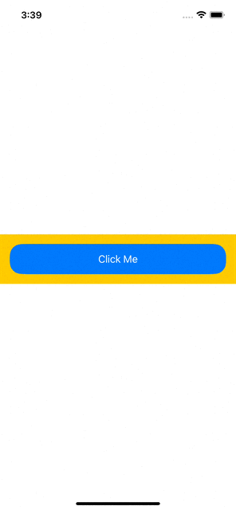
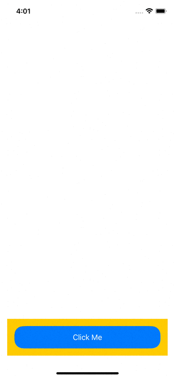
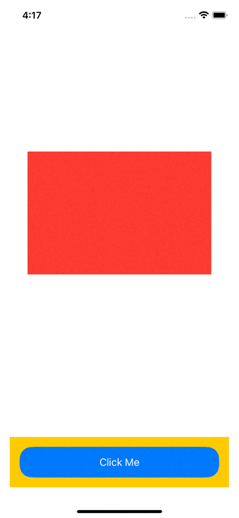
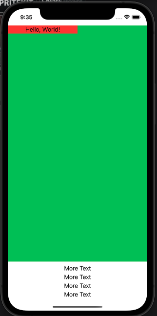
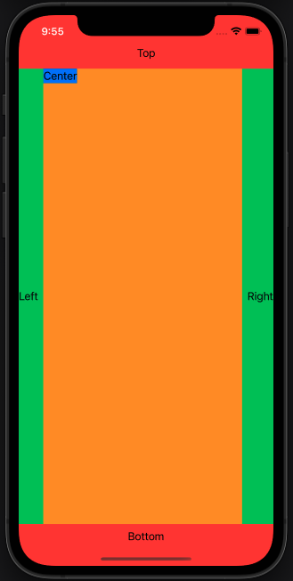

# SwiftUI-Advanced

# I. Custom Button Style

Được sử dụng để custom action khi press Button và sth :))

```swift
struct ButtonStyleCustom: ButtonStyle {
    
    let background: Color
    
    init(background: Color = .red) {
        self.background = background
    }
    
    func makeBody(configuration: Configuration) -> some View {
        configuration.label
            .background(configuration.isPressed ? background : .yellow)
            .scaleEffect(configuration.isPressed ? 0.5 : 1.0)
            
    }
    
}


struct ButtonStyleView: View {
    var body: some View {
        Button(action: {
            
        }, label: {
            Text("Click Me")
                .foregroundColor(.white)
                .frame(maxWidth: .infinity)
                .frame(height: 50)
                .cornerRadius(20)
                .background(.blue)
                .cornerRadius(20)
                .padding()
                
        })
        .buttonStyle(ButtonStyleCustom(background: .red))
    }
}
```



# II. Custom AnyTransition

Được sử dụng để custom 1 View biến mất hay xuất hiện, dưới đây là ta sử dụng `transition(.move)` của hệ thống:

```swift
struct CustomTransition: View {
    
    @State private var showRec = false
    
    var body: some View {
        VStack(alignment: .center, spacing: 8) {
            
            if showRec {
                Rectangle()
                    .fill(.red)
                    .frame(width: 300, height: 200)
                    .transition(.move(edge: .leading))
                    .padding(.top, 200)
            }

                
            Spacer()
            
            Button(action: {
                withAnimation(.easeOut) {
                    showRec.toggle()
                }
            }, label: {
                Text("Click Me")
                    .foregroundColor(.white)
                    .frame(maxWidth: .infinity)
                    .frame(height: 50)
                    .cornerRadius(20)
                    .background(.blue)
                    .cornerRadius(20)
                    .padding()
                    
            })
            .buttonStyle(ButtonStyleCustom(background: .red))
            .padding()
        }
    }
}

```

Output:



Bây giờ ta sẽ tự triển khai `custom transition`:


```swift
struct RotateViewModifier: ViewModifier {
    
    let rotation: Double
    
    func body(content: Content) -> some View {
        content
            .rotationEffect(Angle(degrees: rotation))
            .scaleEffect(rotation != 0 ? 2 : 1)
    }
    
}


extension AnyTransition {
    
    static var rotatingCustom: AnyTransition {
        return AnyTransition.modifier(active: RotateViewModifier(rotation: 100),
                                      identity: RotateViewModifier(rotation: 0))
    }
    
}


struct CustomTransition: View {
    
    @State private var showRec = false
    
    var body: some View {
        VStack(alignment: .center, spacing: 8) {
            
            if showRec {
                Rectangle()
                    .fill(.red)
                    .frame(width: 300, height: 200)
                    .transition(AnyTransition.rotatingCustom)
                    .padding(.top, 200)
            }

                
            Spacer()
            
            Button(action: {
                withAnimation(.easeOut) {
                    showRec.toggle()
                }
            }, label: {
                Text("Click Me")
                    .foregroundColor(.white)
                    .frame(maxWidth: .infinity)
                    .frame(height: 50)
                    .cornerRadius(20)
                    .background(.blue)
                    .cornerRadius(20)
                    .padding()
                    
            })
            .buttonStyle(ButtonStyleCustom(background: .red))
            .padding()
        }
    }
}

```

Output:



Về cơ bản ta hiểu là mỗi khi view được xuất hiện hoặc biến mất, thì nó sẽ gọi vào `modifier .transition`, ở đây ta triển khai `rotatingCustom` có `identity` và `active`. `identity` là modifier sau khi đã thực hiện xong quá trình `transition` còn `active` là modifier trong quá trình transition. 

# III. How to use @ViewBuilder in SwiftUI 

Để hiểu về `@ViewBuilder`, ta cần hiểu về `generic`. Giờ ta muốn struct comform `View`, trong đó có 1 parameter `content`, `content` là kiểu generic mà có thể pass bất kì `View` nào vào trong, ta làm như sau:

```swift
struct GenericstructView<CustomType: View>: View {
    
    var content: CustomType
    
    var body: some View {
        content
    }
    
}
```

Lúc này khi sử dụng View đó sẽ như thế này 

```swift
struct ViewBuilderView: View {
    var body: some View {
        GenericstructView(content: HStack(content: {
            Text("Placeholder")
        }))
    }
}
```

Bạn thấy không, nó nhấn rất là rồi mắt, giờ ta mong muốn đoạn `content` đó sẽ được pass như các view khác như `HStack { Text("Placeholder") }`. Để làm được điều này, ta sẽ sử dụng `@ViewBuilder`:


```swift
struct GenericstructView<CustomType: View>: View {
    
    var content: CustomType
    
    init( @ViewBuilder content: () -> CustomType) {
        self.content = content()
    }
    
    var body: some View {
        content
    }
    
}


struct ViewBuilderView: View {
    var body: some View {
        GenericstructView {
            HStack(content: {
                Text("Placeholder")
            })
        }
    }
}

```

# IV. GeomereyReader

Ta sử dụng `GeometryReader` cho phép ta phép lấy và sử dụng size của view cha cho view con của nó. Ta cần biết rằng `SwiftUI sử dụng 3 bước sau` khi làm việc với `GeometryReader`: `View cha` đề nghị size cho `view con`, `view con` sử dụng size đó để quyết định size cho chính bản thân, sau đó `View cha` sẽ sửu dụng điều đó để quyết định vị trí `View con` tương ứng. Nói đơn giản thì thằng `GeometryReader` sẽ cho phép ta đọc size mà được view cha đề nghị, sau đó ta sẽ sử dụng view đó để layout cho view con.

- For example, we could use GeometryReader to make a text view have 90% of all available width regardless of its content:

```swift
struct GeotryReaderView: View {
    var body: some View {
        VStack(alignment: .leading, spacing: 8) {
            
            
            GeometryReader { geo in
                
                Text("Hello, World!")
                    .frame(width: geo.size.width * 0.5)
                    .background(.red)
                    .onAppear {
                        
                        print("DEBUG: \(geo.size)")  //Print: DEBUG: (390.0, 658.9407809031392)
                    }
            }
            .background(.green)
            
        }
        .padding(.top, 1)
        
        Text("More Text")
        Text("More Text")
        Text("More Text")
        Text("More Text")
       
    }
}

```

Output:



Ta có `geo` thuộc kiểu `GeometryProxy`, it contains the proposed size, any safe area insets that have been applied, plus a method for reading frame values that we’ll look at in a moment. `GeometryReader` có một tác dụng phụ thú vị có thể khiến ta khó chịu lúc đầu: Nhìn vào output, ta thấy thằng `GeometryReader` expanded space nhiều nhất nó có thể. Ta cũng thấy rằng in ra `DEBUG: (390.0, 658.9407809031392)`, đây chính là size thằng `GeometryReader` có thể cung cấp và cũng là size đề nghị cho thằng View con. Sau đây là ví dụ về việc `GeometryReader` đọc x, y:

```swift
struct OuterView: View {
    var body: some View {
        VStack {
            Text("Top")
            InnerView()
                .background(.green)
            Text("Bottom")
        }
    }
}

struct InnerView: View {
    var body: some View {
        HStack {
            Text("Left")
            GeometryReader { geo in
                Text("Center")
                    .background(.blue)
                    .onTapGesture {
                        print("Global center: \(geo.frame(in: .global).midX) x \(geo.frame(in: .global).midY)")
                        print("Custom center: \(geo.frame(in: .named("Custom")).midX) x \(geo.frame(in: .named("Custom")).midY)")
                        print("Local center: \(geo.frame(in: .local).midX) x \(geo.frame(in: .local).midY)")
                    }
            }
            .background(.orange)
            Text("Right")
        }
    }
}

struct ContentView: View {
    var body: some View {
        OuterView()
            .background(.red)
            .coordinateSpace(name: "Custom")
    }
}

struct GeotryReaderView: View {
    var body: some View {
        OuterView()
            .background(.red)
            .coordinateSpace(name: "Custom")
       
    }
}

```


Ouput:



The output you get when that code runs depends on the device you’re using, but here’s what I got in iphone 12
- Global center: 189.83 x 430.60
- Custom center: 189.83 x 383.60    `Phần custom này thì vẫn chưa hiểu`
- Local center: 152.17 x 350.96

# V. Use PreferenceKey to extract values from child views in SwiftUI

Tạm bỏ

# VI. Create a custom tab bar in SwiftUI