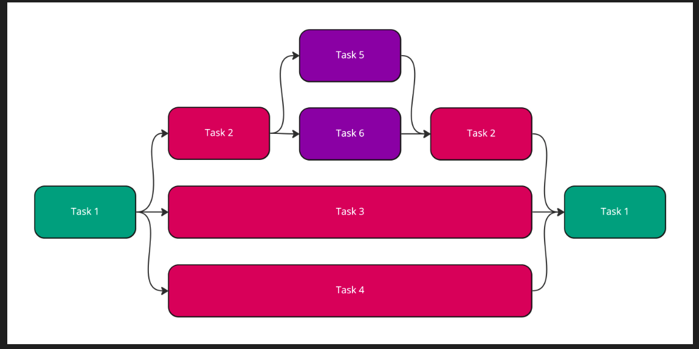

# Concurrency

Ở bài này, ta sẽ nhìn lại tổng quan và chuyên sâu concurrency của Swift, các khải niệm như `Task, Thread Pool, Structed adn Unstructed Concurrency, Async, Await, Actor...`

# I. Thread Pool

## 1.1 Threading Model

Cách Threads được bring up để xử lý công việc trên hàng đợi GCD:
- Như đã biết, mỗi khi cần xử lý 1 công việc, ta sẽ đẩy 1 block code vào trong queue. Sau đó hệ thống sẽ bring up 1 Thread để xử lý công việc đó.
- Bởi vì 1 `concurrent queue` có thể xử lý nhiều công việc 1 lúc, điều này cũng có nghĩa là hệ thống sẽ cần bring up nhiều Thread để xử lý công việc đó cho đến khi ta đạt đến giới hạn của `CPU Cores`.
- Nếu 1 Thread bị block, và vẫn còn nhiều công việc cần được xử lý trên `concurren queue`, GCD sẽ bring up nhiều Thread hơn để xử lý nốt chỗ công việc này.
- What does "a thread is blocked" mean? - Nếu 1 Thread bị block, nó sẽ bị suspended bởi hệ điều hành(`is marked as not eligible for running, so that OS scheduler ignores it when selecting threads to run`) cho đến khi OS unblock nó. Ta cũng cần biết rằng `OS chịu trách nhiệm cho việc lên lịch Threads.`

Với GCD, có rất nhiều rủi ro khi thực thi các công việc concurrency:
- Khi số lượng Threads nhiều hơn số lượng CPU Cores mà hệ điều hành có thể xử lý(e.g., Apple Watch only has 2 cores).
- Quá nhiều Thread dẫn đến tiêu tốn nhiều hiệu năng:
  - Chí phí bộ nhớ: Như là khi 1 Thread bị blocked, thì nó cũng đang cầm rất nhiều biến và tài nguyên, dẫn đến khi nó ko running cũng làm tăng bộ nhớ.
  - Chi phí switching threads.: Khi một Thread mới được bring up, CPU sẽ cần thực hiện một quá trình `context switching` để chuyển đổi công việc từ Thread cũ sang Thread mới.


Với các vấn đề nêu trên, `Swift Concurrency` được sinh ra với mục đích:
- Chỉ có 1 Thread được thực thi trên mỗi CPU Core, điều này cũng có nghĩa là chỉ tạo số lương Threads bằng số lượng CPU Cores.
- No context switches

Để đạt được điều này, hệ thống cần một `runtime contract` mà sẽ ko block Thread, và nó chỉ khả thi khi nếu ngôn ngữ lập trình cho phép ta điều đó. May thay Swift cho phép ta làm vậy:
- `await` and non-blocking of threads: Ta cần hiểu rằng `await` sẽ không block bất kì Thread nào cả trong khi nó đợi kết quả trả về. Thay thì vậy, function sẽ bị suspended, và Thread đó sẽ được tiếp tục thực thi các Task vụ khác. Ta thấy rằng, ko một Thread nào bị block cả. Vậy làm thế làm để `await` có thể đảm bảo việc suspension và resumption khi cần

## 1.2 How await is designed to ensure efficient suspension and resumption

How `sync` functions work:

- Ta cũng cần biết là mỗi một Thread khi chạy đều có một `stack`, `stack` đó được sử dụng để lưu các trạng thái state.
- Khi một function được gọi trên một Thread, thì sẽ có một frame mới đẩy vào trong stack. Ta cũng gọi frame này là `stack frame`, `stack frame` mới này sẽ được sử dụng cho việc lưu trữ các parameters, local variables, return address,...
-  Khi function được gọi đó thực thi xong, thì `stack frame` sẽ được pop.

Vậy how `async` functions work:

- Cũng tương tự như `sync function`, một `async func` cũng có 1 `stack frame`, nhưng nó được lưu trên heap.
- Bởi vì các thông tin này được lưu trên heap, nên nó được giữ lại, điều này cũng có nghĩa là các thông tin này sau đó sẽ được sử dụng tiếp khi được thực thi sau đó.

## 1.3 Tóm tắt

## 1.3.1 Tóm tắt 1

Trong compoter programming, Một `Thread Pool` là 1 software design pattern, được sử dụng cho việc đạt được cơ chế `concurrency`. Bằng cách duy trì một `Thread Pool`, hệ thống sẽ tăng perfornmance và làm giảm độ trễ do việc liên tục tạo và huỷ các Thread. Số lượng `Threads` trong một `Thread Pool` sẽ được điều chỉnh theo tài nguyên đang có của hệ thống.
- Trong Swift, thì `Thread Pool` cũng là một cơ chế được sử dụng cho quản lý một nhóm các Threads một cách hiệu quả để thực thi các công việc `concurrency Task`. A thread pool helps to avoid the overhead of creating and destroying threads for each task, as creating and destroying threads can be resource-intensive.
- `Thread Pool`: Một `Thread Pool` là một tập hợp các `working threads` mà đã được tạo và quản lý bởi hệ thống. Thay vì create thêm một Thread mới cho mỗi task, `Thread Pool` sẽ sử dụng các Threads đang tồn tại của mình để làm tăng khả năng hiệu quả và tái sử dụng.
- `Queue`: `Task` được thực thi trong 1 `Queue`. `Thread Pool` sẽ nhận `task` đó từ `Queue`, sau đó gán cho một `Thread` đang available. Ở đây ta cũng hiểu luôn là một `Task` tuy có thể được tạo từ `Thread Main` nhưng mà nó cũng có thể được thực thi ở `Thread` khác.
- `Worker Threads`: Các Threads này mới là các Threads thực sự làm v  iệc. `They are created and managed by the thread pool. Worker threads take tasks from the task queue, execute them, and then become available to take on more tasks.`


## 1.3.2 Tóm tắt 2

Như đã biết, một `func async` không có nghĩa là func ấy chắc chắn sẽ chạy trên `Background Thread`, một func được mark là `async` chỉ thể hiện func ấy có thể thực thi các công việc bất đồng bộ. 

```swift
class ConcurrencyModel: ObservableObject {
    func sayHello() async {
        print("DEBUG: \(Thread.isMainThread)")   //DEBUG: False
        
    }
}

struct ContentView: View {
    
    @ObservedObject private var viewModel = ConcurrencyModel()
    
    var body: some View {
        VStack {
            Text("Hello, world!")
        }
        .task {
            await viewModel.sayHello()
        }
    }
}
```

Ta thấy output in ra là `false`, có nghĩa là nó ko được chạy trên `Main Thread`. Một nhà hiền triết đã nói rằng `Hệ điều hành không quan tâm một func async được gọi ở đâu, thay vì đó func async đó tự quyết định nơi nó nên được chạy. Và gàn như 100% async func sẽ chạy trên global excutor trừ khi nó được hướng dẫn là được chạy ở đâu khác` Vậy làm thế nào ta quyết định nơi func nên run ? 

- Câu trả lời cho việc đó là sử dụng `@MainActor`, `MainActor` cũng có nghĩa là `MainThread`. Khi ta đánh dầu 1 func là `MainActor`, ta đã hướng dẫn nó sẽ được chạy ở `Mainthread`. Từ đây nhiều người sẽ đặt câu hỏi, khi tôi gọi 1 func trên `mainThread`, và `await` nó, vậy điều này sẽ block `MainThread`? 

Câu trả lời là không, `await` không block 1 Thread nào cả. `await` sẽ free cho Thread đó tiếp tục chạy để thực thi các Task vụ khác. Quy trình đó sẽ như sau:
- Thread 1 đang chạy 1 block code blue, chạy được 1 lúc thì gặp đoạn code `await`(`await` ở đây là các function, api của hệ thống được hệ thống đánh là await, chứ ko phải cứ func mình đefine là async thì khi chạy là await). Lúc này vì `đoạn code await của hệ thống cần chạy mất nhiều thời gian`, `task` đó sẽ được đẩy lên cache để cho Thread đó tiếp tục chạy các Task vụ sau.
- Lúc này trong `Thread Pool` có Thread 3 đang free và available, nên nó sẽ bảo `hey tôi đang available, để tôi handle tiếp block blue đó cho`, lúc này `block blue` sẽ tiếp tục được chạy trên Thread 3. Tiếp tục đang running trên thread 3 thì gặp await tiếp. Nó sẽ tiếp tục được đẩy lên cache
- Thread 1 lúc này lại rảnh nên bảo *`hey tôi đang rảnh, tôi sẽ handel tiếp Task vụ này`. Thế là Task vụ này lại được xử lý trên Thread 1. Tiếp tục đang running trên thread 1 thì gặp await tiếp, nma luc này `Thread 1 bảo tôi ko có Task vụ sau nên tôi cũng đang rảnh, nên cứ để tối handle tiếp, các bạn ok ko,...`
- Thực ra quá trình Task vụ được chạy trên Thread này hoàn toàn do Task vụ đó lựa chọn, nó sẽ random để chạy trên bất kì Thread nào, kể cả Thread main.

```swift
class ConcurrencyModel: ObservableObject {
    func sayHello() async {
        print("DEBUG: \(Thread.current)")
        
        try? await Task.sleep(nanoseconds: 1000000)
        print("DEBUG: \(Thread.current)")
        
        try? await Task.sleep(nanoseconds: 1000000)
        print("DEBUG: \(Thread.current)")
        
        try? await Task.sleep(nanoseconds: 1000000)
        print("DEBUG: \(Thread.current)")
        
        try? await Task.sleep(nanoseconds: 1000000)
        print("DEBUG: \(Thread.current)")
        
        try? await Task.sleep(nanoseconds: 1000000)
        print("DEBUG: \(Thread.current)")
    }
}

struct ContentView: View {
    
    @ObservedObject private var viewModel = ConcurrencyModel()
    
    var body: some View {
        VStack {
            Text("Hello, world!")
        }
        .task {
            await viewModel.sayHello()
        }
    }
}
```

Output:

```
DEBUG: <NSThread: 0x600001754b40>{number = 7, name = (null)}
DEBUG: <NSThread: 0x60000174c580>{number = 3, name = (null)}
DEBUG: <NSThread: 0x600001754600>{number = 6, name = (null)}
DEBUG: <NSThread: 0x600001754600>{number = 6, name = (null)}
DEBUG: <NSThread: 0x60000174c580>{number = 3, name = (null)}
DEBUG: <NSThread: 0x60000174c580>{number = 3, name = (null)}
DEBUG: <NSThread: 0x60000174c580>{number = 3, name = (null)}
DEBUG: <NSThread: 0x600001754f40>{number = 8, name = (null)}
DEBUG: <NSThread: 0x600001754600>{number = 6, name = (null)}
DEBUG: <NSThread: 0x600001754600>{number = 6, name = (null)}
DEBUG: <NSThread: 0x600001754600>{number = 6, name = (null)}
```

Ta thấy rằng, cứ gặp await thì nó sẽ switch qua 1 Thread khác bất kì, bao gồm cả Thread nó đang chạy. Dẫn đến ko hề có 1 Thread nào bị block. Khi ta đánh dấu nó là `MainActor`:

```swift

class ConcurrencyModel: ObservableObject {
    
    @MainActor
    func sayHello() async {
        print("DEBUG: \(Thread.current)")
        
        try? await Task.sleep(nanoseconds: 50)
        print("DEBUG: \(Thread.current)")
        
        try? await Task.sleep(nanoseconds: 20)
        print("DEBUG: \(Thread.current)")
        

    }
}

struct ContentView: View {
    
    @ObservedObject private var viewModel = ConcurrencyModel()
    
    var body: some View {
        VStack {
            Text("Hello, world!")
        }
        .task {
            await viewModel.sayHello()
        }
        .task {
            for i in 0 ... 10 {
                if i == 5 {
                    try? await Task.sleep(nanoseconds: 1000000)
                }
                print("DEBUG: \(i)")
            }
        }
    }
}
```


Output:
```
DEBUG: <_NSMainThread: 0x600001708000>{number = 1, name = main}
DEBUG: 0
DEBUG: 1
DEBUG: 2
DEBUG: 3
DEBUG: 4
DEBUG: <_NSMainThread: 0x600001708000>{number = 1, name = main}
DEBUG: <_NSMainThread: 0x600001708000>{number = 1, name = main}
DEBUG: 5
DEBUG: 6
DEBUG: 7
DEBUG: 8
DEBUG: 9
DEBUG: 10
```

Phân tích:
- Đầu tiên thằng `viewModel.sayHello()`(gọi là Block Code Blue) sẽ gọi trước nên sẽ in ra thông tin `Thread.current`. Sau đó nó gặp thằng `await Task.sleep`, lúc này Block Code Blue sẽ được đẩy lên cache và cho thằng `Thread khác xử lý đoạn sleep đó`, và nhả main cho vòng `for`, lúc này thằng `for` sẽ cầm `main thread`, và print từ `0 đến 4`, sau đó vòng for gặp thằng `await Task.sleep`, và sleep tận 1000000, nên sau đó thằng block code blue sau khi qua thằng `Task.sleep` đã được `Thread khác xử lý`, nó sẽ tiếp tục được đẩy về main thread, và print ra thông tin `Thread.current`.
- Ta thấy xuyên suốt quá trình này thì `MainThread` không bị blocked 1 tí nào cả, và nó chạy xuyên suốt quá trình.


# II. Structured adn Unstrcutured Concurrency

`Swift Concurrency` dựa vào concept gọi là `Structured Concurrency` để miêu tả mối quan hệ giữa parent và child tasks.



Trong hình ảnh trên, ta có thấy rằng Task 1 sẽ kick off 3 Tasks khác, Task 2 lại kick off 2 Task khác. Task 1 chỉ kết thúc khi các Tasks khác cũng chưa kết thúc. Swift Concurrency is heavily based on this model but it expands on some of the details a little bit. 
- Khi bất kì child tasks nào được sinh ra mà failed, parent task có thể quyết định xử lý vấn đề đó và cho phép các child tasks khác tiếp tục. Cũng tương tự, parent task có thể quyết định cancell tất cả các child tasks. `Structured Concurrency` tập trung vào miêu tả mối quan hệ giữa parent và child tasks, `và cách parent task cannot complete when one or more of its child tasks are still running.`

## 2.1 Structured concurrency in action

Đây là ví dụ minh hoạ đơn gianr nhất về cấu trúc `Structured concurrency` đó là: Ta bắt đầu một Task, thực thi vài công việc, sau đó `await some async call`, cuối cùng là kết thúc task:

```swift
func parseFiles() async throws -> [ParsedFile] {
  var parsedFiles = [ParsedFile]()

  for file in list {
    let result = try await parseFile(file)
    parsedFiles.append(result)
  }

  return parsedFiles
}
```

Các ví dụ về `structed concurrency` như `async let, TaskGroup`, những thằng này phải return thì Task chính mới return.

## 2.2 Unstructured concurrency 

Một `Unstructured Task` là một Task mà ko có parent/child relationship với nơi nó nó được gọi. Thay vì đó ta sẽ tạo ra một hòn đảo của concurrency với riêng scrope và lifecycle của riêng nó. Tuy nhiên nó ko có nghĩa là `unstructured task` được tạo mà ko có bất kì liên quan tới bất kì thứ gì khác. `Unstructure task` sẽ kế thừa 2 điều sau từ nơi nó được gọi:
- The actor we’re currently running on (if any)
- Task local values

Ta hiểu rằng bất kì Task nào được tạo trong một Actor sẽ tham gia vào actor isolation cho chính actor đó. Như là ta có safety access method và properties từ Task mà được tạo bên trong Actor đó:

```swift
actor SampleActor {
  var someCounter = 0

  func incrementCounter() {
    Task {
      someCounter += 1
    }
  }
}
```

If we were to mutate someCounter from a context that is not running on this specific actor we’d have to prefix our someCounter += 1 line with an await since we might have to wait for the actor to be available.

Chú ý rằng, task của chúng ta ko nhất thiết phải complete trước khi func `incrementCounter()` return. Điều này cho chúng ta thấy rằng `unstructed Task` mà chúng ta tạo ra ko tham gia vào quá trình `structured concurrency`, bởi vì với `structured concurrency` thì task phải complete thì thằng `incrementCounter` mới được phép complete.

```swift
@MainActor
func fetchData() {
  Task {
    // this task runs its body on the main actor
    let data = await fetcher.getData()

    // self.models is updated on the main actor
    self.models = data
  }
}
```

Ta cần hiểu rằng `await fetcher.getData()` sẽ ko block main actor, chúng ta gọi thằng `getData()` từ context mà đang chạy trên main actor nhưng ko có nghĩa `getData()` sẽ chạy phần body của nó trên main thread. Trừ khi thằng `getData()` chính nó tự explicit được đính với main actor, nếu ko thì nó luôn luôn chạy trên `background thread`. Ta cũng thấy rằng phần task run phần body trên main actor, nên khi result trả về từ `getData()`, thì task của chúng ta sẽ tiếp tục và `self.models` sẽ được update trên main actor.

- Note that while we await something, our task is suspended which allows the main actor to do other work while we wait. We don’t block the main actor by having an await on it. It’s really quite the opposite.

## 2.3 When to use unstructured tasks

Ta thường muốn sử dụng `unstructed task` khi ta muốn thực thi một công việc mà độc lập với công việc được gọi. Ví dụ ta muốn fetch data trong `viewDidLoad`.


## 2.4 Creating detached tasks with Task.detached

`Detached Task` gần như tương tự với `unstructed tasks`. They don’t create a parent / child relationship, they don’t participate in structured concurrency and they create a brand new island of concurrency that we can work with. Điểm khác biệt là thằng `Detached Task` sẽ không kế thừa bất kì 1 cái gì từ context nó được tạo ta. Điều này cũng có nghĩa `Detached Task` sẽ không kế thừa current actor, và cũng không kế thừa task local value.


```swift
actor SampleActor {
  var someCounter = 0

  func incrementCounter() {
    Task.detached {
      // Error: Actor-isolated property 'someCounter' can not be mutated from a Sendable closure
      // Reference to property 'someCounter' in closure requires explicit use of 'self' to make capture semantics explicit
      someCounter += 1
    }
  }
}
```


Lúc này compiler cho ta thấy rằng bây giờ ta ko còn ở trên `SampleActor`. Điều này có nghĩa là ta phải tương tác với actor bằng cách gọi một method hoặc 1 properties với từ khoá `await`. Tương tự với khi ta tạo ra detached task từ main actor, thì phần body detached task sẽ ko được thực thi trên main actor nữa:

```swift
@MainActor
func fetchData() {
  Task.detached {
    // this task runs its body on a background thread
    let data = await fetcher.getData()

    // self.models is updated on a background thread
    self.models = data
  }
}
```

Note that detaching our task has no impact at all on where getData() executed.` Since getData() is an async function it will always run on a background thread unless the method was explicitly annotated with an @MainActor annotation`. This is true regardless of which actor or thread we call getData() from. It’s not the callsite(địa điểm gọi) that decides where a function runs. It’s the function itself.


## 2.5 When to use detached tasks

So a detached task really only makes sense if the work you’re doing should be away from the main thread, doesn’t involve awaiting a bunch of functions, and the work you’re doing should not participate in structured concurrency.


# V. Reference

1. [Swift concurrency: Behind the scenes](https://www.wwdcnotes.com/notes/wwdc21/10254/)
2. [Understanding unstructured and detached tasks in Swift](https://www.donnywals.com/understanding-unstructured-and-detached-tasks-in-swift/)