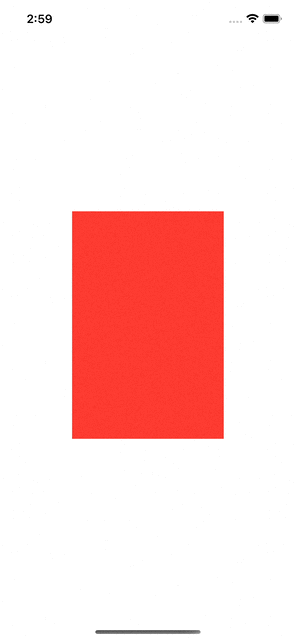

# DragGesture and Offset

```swift
struct OffsetView: View {
    
    @State private var offset: CGSize = .zero
    @State private var latestOffset: CGSize = .zero
    
    var body: some View {
        Rectangle()
            .fill(.red)
            .frame(width: 200, height: 300)
            .offset(x: offset.width, y: offset.height)
            .gesture(
                DragGesture()
                    .onChanged { drag in
                        self.offset = .init(width: drag.translation.width + self.latestOffset.width,
                                            height: drag.translation.height + self.latestOffset.height)

                    }
                    .onEnded { drag in
            
                        self.latestOffset.width = drag.translation.width + self.latestOffset.width
                        self.latestOffset.height = drag.translation.height + self.latestOffset.height
                    }
            )
    }
}
```

Output:



Về cơ bản thì hàm offset sẽ di chuyển `offset` render 1 view đến vị trí khác so với vị trí gốc. Ta cần 1 biến `latestOffset` để lưu lại vị trí của `View` sau các lần di chuyển, bởi vì nếu ko lưu thì giá trị `drag` sẽ bị reset về 0, chứ ko phải vị trí ta đã di tới.