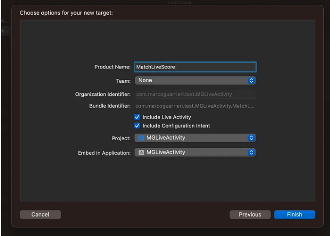
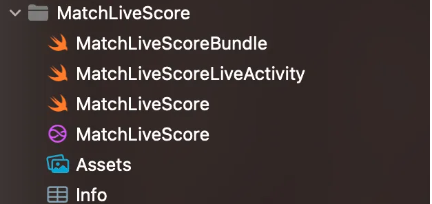
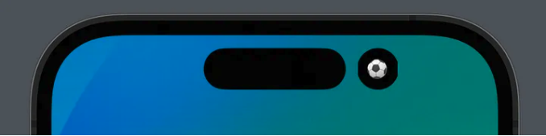

# LiveActivity And DynamicIsland

# I. Displaying live data with Live Activities

Các thiết 


# II. How to build an iOS Live Activity

Một trong những tính năng quan trọng nhất được giới thiệu trong IOS 16 đó là `Live Activities`, tính năng này cho phép người dùng có thể quan sát các thông tin 1 cách real time trên `Lock Screen`

# 2.1 HOW IT WORKS

Ta có thể coi `Live Activities` như là một widget với khả năng được updated 1 cách real time. Việc update này được trigger bằng cách sử dụng 1 function trong code hoặc sử dụng push notification được gửi tới thiết bị từ backend service. Khi `Live Activitu` được started, nó sẽ được hiển thị trên lock screen, và dựa trên update push notification, nó sẽ được tự động refresh. Tuy nhiên có 1 thực tế là khi được present trên device, nó cũng được shown trên `Dynamic Island`, và trong trường hợp này `Live Activity` sẽ có 3 UI khác nhau:

- `Minimal`:  our live activity is secondary shown respect another one
- `Compact`:  our live activity is the main one shown to the user
- `Expanded`: our live activity has been expanded by the user with a long press or it has just received an update and so it has been automatically expanded by the system

`So, considering also the widget in the lock screen, we should think about designing 4 kinds of Live Activity UI.`

# 2.2 HOW TO START

Đầu tiên ta phải làm cho app chúng ta phải support `Live Activities`, ta vào file Info vào gán `Supports Live Activities` đi cùng với value là `yes`


Another thing to add to the app to make this sample code work, is adding the push notification capabilities in the Signin & Capabilities tab.


`NOTE`: This isn’t actually always necessary, as said a Live Activity can be updated through push notifications or just via code, but for the sake of this guide, I’m already showing how to add the capability to use the notification here. `Later on it will be more clear when you should or should not add it.`

Sau đó ta add `Widget extension` và bao gồm select `Include Live Activy`



Lúc này ta sẽ được các file sau đây:




- `MatchLiveScore:` Đây là file `Widget class` thông thường, và ta đã học rồi nên sẽ ko nói ở đây.

- `MatchLiveScoreLiveActivity`: Đây chính là file `Live Activity`, nơi ta sẽ viết vô vàn dạng UI khác nhau ở đây. Cũng ở chính file này, ta thấy 1 struct được define ở đây, chính là struct `MatchLiveScoreAttributes`:

```swift
struct MatchLiveScoreAttributes: ActivityAttributes {
    public struct ContentState: Codable, Hashable {
        // Dynamic stateful properties about your activity go here!
        var value: Int
    }

    // Fixed non-changing properties about your activity go here!
    var name: String
}
```

Đây là 1 struct cơ bản mà được sử dụng để định nghĩa các properties mà ta sẽ dụng trong `Live Activity UI`. Ở đây SwiftUI đã cho ta các comment, với property `name`, ta thấy hệ thống coi nó là 1 giá trị không thay đổi trong suốt quá trình update. Còn với `ContentState`, ta có biến `value` thuộc kiểu `Int`, đây chính là giá trị được update trong quá trình real time.

- `MatchLiveScoreBundle:` Ở đây ta sẽ quyết định cái gì sẽ được available tới user: 

```swift
@main
struct MatchLiveScoreBundle: WidgetBundle {
    var body: some Widget {
        MatchLiveScore()
        MatchLiveScoreLiveActivity()
    }
}
```

- `MatchLiveScore()`: this is the normal widget, the one that you can implement inside the homonym file MatchLiveScore.swift
- `MatchLiveScoreActivity()`: this is the live activity widget that we are going to implement in our app.


## 2.3 ATTRIBUTES

Như đã nói, `MatchLiveScoreAttributes` là struct mà ta sẽ sử dụng để định nghĩa các properties được hiển thị trong live activity. Có 2 loại properties, một là `static`, nghĩa là khi `Live Activity` được created và được hiển thị thì properties này sẽ có static value, và loại thứ 2 là các properties được define bên trong `sub-struct ContentState`, và loại này thì có thể được modified và sau đó nó sẽ update `realtime` lên `Live Activity`.  Để lấy ví dụ với 1 trận đá bóng, ta có thể tạo 1 live activity với các static values đó là `name của teams, sân vẫn động`, bởi vì cá giá trị đó sẽ không bao giờ thay đổi xuyên suốt trận đấu của nó. Trong khi ta có thể sử dụng các `dynamic properties` để set các thông tin như `current match score,  or the last event occurred in the match (a player who scored a goal or has been booked by the referee).`

- Các `dynamic properties` đơn giản là những thuộc tính mà sẽ được passed vào trong push notification để làm cho `activity live update automatically.` Ở đây ta sẽ sẽ lấy ví dụ về `static properties` và `dynamic properties`

```swift
struct MatchLiveScoreAttributes: ActivityAttributes {
    public struct ContentState: Codable, Hashable {
        // Dynamic Properties
        var homeTeamScore: Int
        var awayTeamScore: Int
        var lastEvent: String
    }
    
    // Static Properties
    var homeTeam: String
    var awayTeam: String
    var date: String
}
```

So when we will start a Live Activity, we will already know the name of the teams and the date of the match, and we know those properties will never change during this particular live score, so those are constant. The score of each team and the last event occurring will obviously mutate through the game, so those are dynamic and will be updated in the future.

- Bây giờ ta sẽ sử dungj các thông tin này bên trong activity, so that we will show to the user all the information needed, both the static and dynamic ones. Như đã nói ta sẽ `build different layouts for each Live Activity UI shown to the user:`

```swift
struct MatchLiveScoreLiveActivity: Widget {
    var body: some WidgetConfiguration {
        ActivityConfiguration(for: MatchLiveScoreAttributes.self) { context in
            // Lock screen/banner UI goes here
            VStack {
                Text(context.attributes.date)
                    .font(.caption2)
                    .padding(4)
                    .frame(maxWidth: .infinity, maxHeight: .infinity)
                    .background(.tertiary)
                HStack {
                    Spacer()
                    HStack {
                        Spacer()
                        Text("\(context.attributes.homeTeam)")
                        Text("\(context.state.homeTeamScore)")
                            .font(.headline)
                    }
                    Text(" - ")
                    HStack {
                        Text("\(context.state.awayTeamScore)")
                            .font(.headline)
                        Text("\(context.attributes.awayTeam)")
                        Spacer()
                    }
                    Spacer()
                }
                HStack {
                    Spacer(minLength: 4)
                    Text(context.state.lastEvent)
                        .font(.subheadline)
                    Spacer(minLength: 4)
                }
                .padding(4)
                .frame(maxWidth: .infinity, maxHeight: .infinity)
                .background(.mint)
            }
            .activityBackgroundTint(Color.white)
            .activitySystemActionForegroundColor(Color.black)
            
        } dynamicIsland: { context in
            DynamicIsland {
                DynamicIslandExpandedRegion(.leading) {
                    Text("\(context.attributes.homeTeam) \(context.state.homeTeamScore)")
                }
                DynamicIslandExpandedRegion(.trailing) {
                    Text("\(context.state.awayTeamScore) \(context.attributes.awayTeam)")
                }
                DynamicIslandExpandedRegion(.bottom) {
                    HStack {
                        Spacer(minLength: 4)
                        Text(context.state.lastEvent)
                            .font(.subheadline)
                            .foregroundColor(.black)
                        Spacer(minLength: 4)
                    }
                    .padding(4)
                    .frame(maxWidth: .infinity, maxHeight: .infinity)
                    .background(.mint)
                    Text(context.attributes.date)
                        .font(.caption2)
                        .padding(4)
                }
            } compactLeading: {
                Text("\(context.attributes.homeTeam) \(context.state.homeTeamScore)")
            } compactTrailing: {
                Text("\(context.state.awayTeamScore) \(context.attributes.awayTeam)")
            } minimal: {
                Text("⚽")
            }
            .widgetURL(URL(string: "https://markwarriors.github.io/"))
            .keylineTint(Color.red)
        }
    }
}
```


Sau đó ta sẽ mock preview với đoạn code sau:

```swift
struct MatchLiveScoreLiveActivity_Previews: PreviewProvider {
    static let attributes = MatchLiveScoreAttributes(homeTeam: "Badger",
                                                     awayTeam: "Lion",
                                                     date: "12/09/2023")
    static let contentState = MatchLiveScoreAttributes.ContentState(homeTeamScore: 0,
                                                                    awayTeamScore: 0,
                                                                    lastEvent: "Match start")
    
    static var previews: some View {
        attributes
            .previewContext(contentState, viewKind: .dynamicIsland(.compact))   //Hiển thị trên Dynamic Island ở chế độ normal
            .previewDisplayName("Island Compact")
        attributes
            .previewContext(contentState, viewKind: .dynamicIsland(.expanded)) //Hiển thị trên Dynamic Island ở chế độ expanded
            .previewDisplayName("Island Expanded")
        attributes
            .previewContext(contentState, viewKind: .dynamicIsland(.minimal))   //Hiển thị trên Dynamic Island ở chế độ minimal
            .previewDisplayName("Minimal")
        attributes
            .previewContext(contentState, viewKind: .content)                   //Hiển thị trên Lock Screen 
            .previewDisplayName("Notification")
    }
}
```

Ta sẽ thu được lần lượt các preview tương ứng sau:

- Hiển thị trên Dynamic Island ở chế độ normal:


- Hiển thị trên Dynamic Island ở chế độ expanded:


- Hiển thị trên Dynamic Island ở chế độ minimal:



- Hiển thị trên Lock Screen:


## 2.4 START AND MANAGE AN ACTIVITY


Để khởi tạo và quản lý một `live activity`, ta cần viết 1 vài đoạn code. Để dễ dàng cho việc quản lý `live activity`, ta tạo 1 class tương ứng cho việc khởi tạo nó.


```swift
import ActivityKit
import Foundation

final class ActivityManager: ObservableObject {
    @MainActor @Published private(set) var activityID: String?
    @MainActor @Published private(set) var activityToken: String?
    
    static let shared = ActivityManager()
    
    func start() async {
        await endActivity()
        await startNewLiveActivity()
    }
    
    private func startNewLiveActivity() async {
        let attributes = MatchLiveScoreAttributes(homeTeam: "Badger",
                                                  awayTeam: "Lion",
                                                  date: "12/09/2023")
        
        let initialContentState = ActivityContent(state: MatchLiveScoreAttributes.ContentState(homeTeamScore: 0,
                                                                                               awayTeamScore: 0,
                                                                                               lastEvent: "Match Start"),
                                                  staleDate: nil)
        
        let activity = try? Activity.request(
            attributes: attributes,
            content: initialContentState,
            pushType: .token
        )
        
        guard let activity = activity else {
            return
        }
        await MainActor.run { activityID = activity.id }
        
        for await data in activity.pushTokenUpdates {
            let token = data.map {String(format: "%02x", $0)}.joined()
            print("Activity token: \(token)")
            await MainActor.run { activityToken = token }
            // HERE SEND THE TOKEN TO THE SERVER
        }
    }
    
    func updateActivityRandomly() async {
        guard let activityID = await activityID,
              let runningActivity = Activity<MatchLiveScoreAttributes>.activities.first(where: { $0.id == activityID }) else {
            return
        }
        let newRandomContentState = MatchLiveScoreAttributes.ContentState(homeTeamScore: Int.random(in: 1...9),
                                                                          awayTeamScore: Int.random(in: 1...9),
                                                                          lastEvent: "Something random happened!")
        await runningActivity.update(using: newRandomContentState)
    }
    
    func endActivity() async {
        guard let activityID = await activityID,
              let runningActivity = Activity<MatchLiveScoreAttributes>.activities.first(where: { $0.id == activityID }) else {
            return
        }
        let initialContentState = MatchLiveScoreAttributes.ContentState(homeTeamScore: 0,
                                                                        awayTeamScore: 0,
                                                                        lastEvent: "Match Start")

        await runningActivity.end(
            ActivityContent(state: initialContentState, staleDate: Date.distantFuture),
            dismissalPolicy: .immediate
        )
        
        await MainActor.run {
            self.activityID = nil
            self.activityToken = nil
        }
    }
    
    func cancelAllRunningActivities() async {
        for activity in Activity<MatchLiveScoreAttributes>.activities {
            let initialContentState = MatchLiveScoreAttributes.ContentState(homeTeamScore: 0,
                                                                            awayTeamScore: 0,
                                                                            lastEvent: "Match Start")
            
            await activity.end(
                ActivityContent(state: initialContentState, staleDate: Date()),
                dismissalPolicy: .immediate
            )
        }
        
        await MainActor.run {
            activityID = nil
            activityToken = nil
        }
    }
    
}
```

Trong class trên ta có 2 biến cần phải observed:
- `activityId`: Đây là ID của activity mà sẽ được tạo mỗi khi activity được tạo. Chú ý rằng ta có thể có `multiple running activities` trong app của chúng ta, tuy nhiên trong ví dụ này ta chỉ đơn giản tạo 1 activity.
- `activityToken`: Đây là token được sinh ra cho `current activity`, đây chính là token cho bên backend dành cho việc tạo `activity-update push notification`.

Bên cạnh đó ta cũng có rất nhiều function mà ta sẽ sử dụng để quản lý activity.
- `start()`: Cancel tất cả các activities đang running, sau đó bắt đầu 1 cái mới.
- `startNewLiveActivity()`: Yêu cầu việc khởi tạo và bắt đầu một activity mới, truyền các giá trị `initial properties values`, sau đó ta sẽ nhận được `activityID` và `activityToken`.
- `updateActivityRandomly()`: where, for sake of code-update example, the current running activity is updated with some random values.
- `endActivity()`: Ở đây ta sẽ tìm `live activity` nào có id trùng với `activityID` được luwu trong manager, sau đó kết thúc nó. so that means it will not be shown anymore in the dynamic island and in the lock screen
- `cancelAllRunningActivities()`: that run through all the current running activities (of the specified type MatchLiveScoreAttributes) and ends it all


Phần dưới ta sẽ đi chi tiết từ việc start, đền update, và cuối cùng là kết thúc một activity.

### 2.4.1 Start Activity

```swift
let attributes = MatchLiveScoreAttributes(homeTeam: "Badger",
                                         awayTeam: "Lion",
                                         date: "12/09/2023")

let initialContentState = ActivityContent(state: MatchLiveScoreAttributes.ContentState(homeTeamScore: 0,
                                                                                        awayTeamScore: 0,
                                                                                        lastEvent: "Match Start"),
                                            staleDate: nil)

let activity = try? Activity.request(
    attributes: attributes,
    content: initialContentState,
    pushType: .token
)
```

Như đã nói, đề tạo một `Activity`, ta cần define các attributes(đó là `static value`) và `initital content`(đó là dynamic values) của nó. Ở đây, ta tạo một `MatchLiveScoreAttributes`, gán tất cả các giá trị cho tất cả các parameters mà ta khai báo là `static values`, và một `ActivityContent`. `ActivityContent` sẽ được khởi tạo thông qua các `parameters` dưới đây.

- `state`: the initial ContentState (in our example a MatchLiveScoreAttributes.ContentState ) for the live activity
- `staleDate`(ngày cũ): Đây là thời điển chỉ định cho hệ thống biết rằng khi nào `live activity` của ta được coi là outdated. Nếu nó được gán là `nil`, thì giá trị của nó sẽ được coi là 8 giờ, nghĩa là sau 8h thì `live activity` này sẽ được coi là outdated.
- `relevanceScore`: Đây là mức độ ưu tiên của `live activity` được hoạt động trong `dynamic island` và cũng như thứ tự của nó trong `lock screen`.


Để thực sự bắt đầu một `activity`, ta phải sử dụng **Activity.request(attributes:, content:, pushType:).** Đây là một `async throwable` với 3 parameters:
-  `attributes`: Đây là một instance của `ActivityAttributes`, trong ví dụ này là `MatchLiveScoreAttributes`.
-  `content`: Đây là một instance của `ActivityAttributes.ContentState`, trong ví dụ này là `MatchLiveScoreAttributes.ContentState`.
-  `pushType`: Chỉ định rằng liệu bản updates của `Live Activity` có phải được đẩy từ `push notifications(passing .token)` hay chúng ta chỉ muốn update `Live Activity` sử dụng `update` function(passing `nil`.)

Khi ta gọi phương thức này, hệ thống sẽ cố gắng khởi tạo và show `Activity` trên thiết bị. Trong trường hợp success, ta sẽ nhận được `activity identifier and the activity token`:

```swift
guard let activity = activity else { return }
print("ACTIVITY IDENTIFIER:\n\(activity.id)")

for await data in activity.pushTokenUpdates {
    let token = data.map {String(format: "%02x", $0)}.joined()
    print("ACTIVITY TOKEN:\n\(token)")
}
```

### 2.4.2 Update Activity

```swift
let contentState = MatchLiveScoreAttributes.ContentState(homeTeamScore: 1,
                                                         awayTeamScore: 3,
                                                         lastEvent: "Match just updated")
        
let content = ActivityContent(state: contentState,
                              staleDate: nil,
                              relevanceScore: 0)

await activity.update(using: newContentState,
                      alertConfiguration: AlertConfiguration(title: "Title",
                                                             body: "Body",
                                                             sound: .default))
```


Mỗi khi ta muốn update `Live Activity`, ta sẽ phải gọi function **update(_:, alertConfiguration:)**. In the same way that we created our initial state, we have to create an ActivityContent with the new updated values that we want to pass to the current running activity, and pass it to the update function. `There is also an additional parameter that we can pass to the function, the alertConfiguration , that if not nil , hệ thống sẽ show 1 alert update theo cách sau đây`:
- `Device with dynamic island`: Nó sẽ được hiển thị trên `dynamic island` với trạng thái `expanded layout`
- `Device without dynamic island`: Nó sẽ được show trên `lock screen` như là một banner presentation


### 2.4.3 End Activity

```swift
let contentState = MatchLiveScoreAttributes.ContentState(homeTeamScore: 3,
                                                         awayTeamScore: 4,
                                                         lastEvent: "Match is finished")
        
let content = ActivityContent(state: contentState,
                              staleDate: nil,
                              relevanceScore: 0)

await activity.end(
    ActivityContent(state: contentState, 
                    staleDate: Date.distantFuture),
    dismissalPolicy: .immediate
)
```


Nếu ta có 1 activity đang running và muốn kết thúc nó, chúng ta có thể sử dụng fuction call `end(_:, dismissalPolicy:)`. Cũng như function bên trên, ta cần truyền vào `ActivityContent` và 1 `dismissalPolicy`. Câu hỏi đặt ra ở đây là tại sao ta cần một `content` khi ta đang kết thúc một `live activity`? Đó là bởi vì `activity` có thể kết thúc nhưng nó vẫn còn được nhìn thấy trên `lock screen`, vì vậy `content` ở lần này được sử dụng cho trường hợp như vậy. Và cái chịu trách nhiệm cho việc quyết định nó còn được hiển thị trên `lock screen` hay không dựa trên parameter `dismissalPolicy`. This policy can have 3 different values:
- `default`: Activity sẽ vẫn được nhìn thấy trên `lock screen` trong vòng 4 giờ cho đến khi nó được remove
- `immediate`: Activity ngay lập tức sẽ được removed hoàn toàn, vì vậy `content` trong trường hợp này là vô dụng
- `after(_ date:)`: Activity sẽ được removed tại thời điểm ta khai báo ở đây, tuy nhiên thời điểm phải trước 4 giờ activity đã kết thúc, nếu ko hệ thống sẽ tự remove `activity` khỏi lọck screen nếu vượt quá khoảng thời gian đó.

## 2.5 Cách sử dụng

Ta có body phần content view như sau:

```swift

struct ContentView: View {
    @StateObject private var activityManager = ActivityManager.shared
    
    var body: some View {
        ZStack(alignment: .center) {
            
            Color.white
            
            VStack {
                VStack(spacing: 8) {
                    Text("Activity ID:")
                        .font(.title3)
                    Text("\(activityManager.activityID ?? "-")")
                        .font(.caption2)
                    Text("Activity Token:")
                        .font(.title3)
                    Text("\(activityManager.activityToken ?? "-")")
                        .font(.caption2)
                }
                Spacer()
                
                if (activityManager.activityID?.isEmpty == false) {
                    VStack {
                    Button("UPDATE RANDOM SCORE FOR LIVE ACTIVITY") {
                        Task {
                            await activityManager.updateActivityRandomly()
                        }
                    }
                    .font(.headline)
                    .foregroundColor(.black)
                    .frame(maxWidth: .infinity, minHeight: 70)
                    }
                    .background(Color.orange)
                    .frame(maxWidth: .infinity)
                    VStack {
                        Button("STOP LIVE ACTIVITY") {
                            Task {
                                await activityManager.cancelAllRunningActivities()
                            }
                        }
                        .font(.headline)
                        .foregroundColor(.white)
                        .frame(maxWidth: .infinity, minHeight: 70)
                    }
                    .background(Color.red)
                    .frame(maxWidth: .infinity)
                }
                else {
                    VStack {
                        Button("START LIVE ACTIVITY") {
                            Task {
                                await activityManager.start()
                            }
                        }
                        .font(.headline)
                        .foregroundColor(.white)
                        .frame(maxWidth: .infinity, minHeight: 70)
                    }
                    .background(Color.blue)
                    .frame(maxWidth: .infinity)
                }
            }
            .padding()
        }
    }
}
```

Ở đây ta thấy lần lượt các Button như `START LIVE ACTIVITY"`, button này call một function **await activityManager.start()**, cũng như các Button khác call các function `update, end` tương ứng. `Chú ý , nếu tài khoản của ta ko phải Apple Developer, ta sẽ ko add được Push Notification`, nên ko thể xét `.token` được, mà sẽ phải như sau:


```swift
let activity = try? Activity.request(
    attributes: attributes,
    content: initialContentState,
    pushType: nil
)
```


# V. Reference

1. [How to build an iOS Live Activity](https://medium.com/kinandcartacreated/how-to-build-ios-live-activity-d1b2f238819e)
2. [Displaying live data with Live Activities - Apple](https://developer.apple.com/documentation/activitykit/displaying-live-data-with-live-activities)
3. [ Human Interface Guidelines > Live Activities - Apple](https://developer.apple.com/documentation/activitykit/displaying-live-data-with-live-activities)