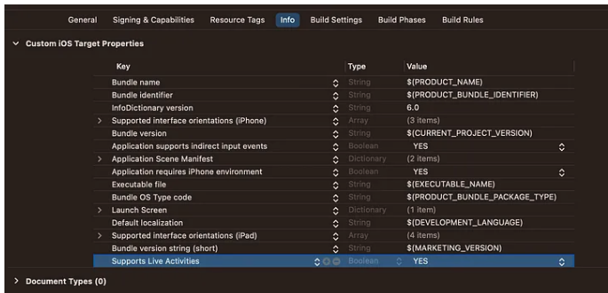
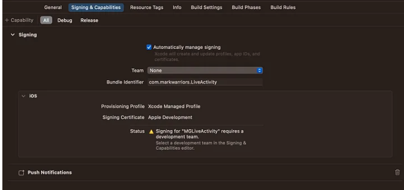
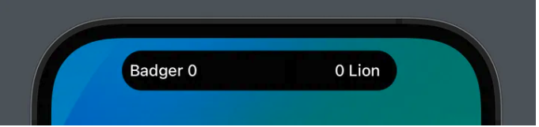
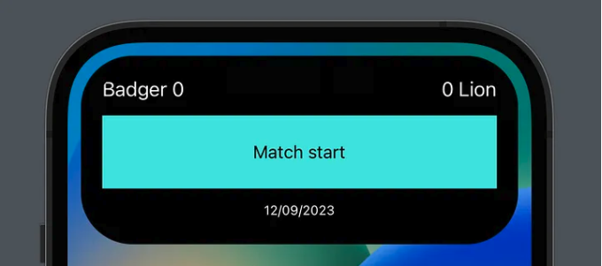
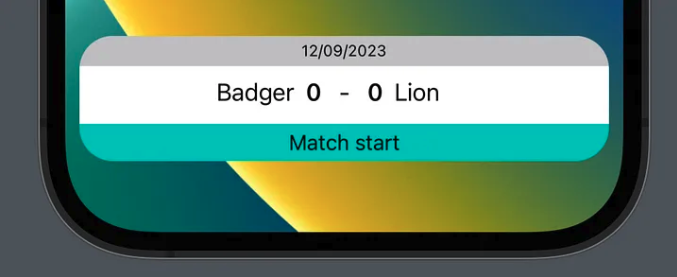

# LiveActivity And DynamicIsland

# I. How to build an iOS Live Activity

Một trong những tính năng quan trọng nhất được giới thiệu trong IOS 16 đó là `Live Activities`, tính năng này cho phép người dùng có thể quan sát các thông tin 1 cách real time trên `Lock Screen`

# 1.1 HOW IT WORKS

Ta có thể coi `Live Activities` như là một widget với khả năng được updated 1 cách real time. Việc update này được trigger bằng cách sử dụng 1 function trong code hoặc sử dụng push notification được gửi tới thiết bị từ backend service. Khi `Live Activitu` được started, nó sẽ được hiển thị trên lock screen, và dựa trên update push notification, nó sẽ được tự động refresh. Tuy nhiên có 1 thực tế là khi được present trên device, nó cũng được shown trên `Dynamic Island`, và trong trường hợp này `Live Activity` sẽ có 3 UI khác nhau:

- `Minimal`:  our live activity is secondary shown respect another one
- `Compact`:  our live activity is the main one shown to the user
- `Expanded`: our live activity has been expanded by the user with a long press or it has just received an update and so it has been automatically expanded by the system

`So, considering also the widget in the lock screen, we should think about designing 4 kinds of Live Activity UI.`

# 1.2 HOW TO START

Đầu tiên ta phải làm cho app chúng ta phải support `Live Activities`, ta vào file Info vào gán `Supports Live Activities` đi cùng với value là `yes`



Another thing to add to the app to make this sample code work, is adding the push notification capabilities in the Signin & Capabilities tab.



`NOTE`: This isn’t actually always necessary, as said a Live Activity can be updated through push notifications or just via code, but for the sake of this guide, I’m already showing how to add the capability to use the notification here. `Later on it will be more clear when you should or should not add it.`

Sau đó ta add `Widget extension` và bao gồm select `Include Live Activy`


Lúc này ta sẽ được các file sau đây:


- `MatchLiveScore:` Đây là file `Widget class` thông thường, và ta đã học rồi nên sẽ ko nói ở đây.

- `MatchLiveScoreLiveActivity`: Đây chính là file `Live Activity`, nơi ta sẽ viết vô vàn dạng UI khác nhau ở đây. Cũng ở chính file này, ta thấy 1 struct được define ở đây, chính là struct `MatchLiveScoreAttributes`:

```swift
struct MatchLiveScoreAttributes: ActivityAttributes {
    public struct ContentState: Codable, Hashable {
        // Dynamic stateful properties about your activity go here!
        var value: Int
    }

    // Fixed non-changing properties about your activity go here!
    var name: String
}
```

Đây là 1 struct cơ bản mà được sử dụng để định nghĩa các properties mà ta sẽ dụng trong `Live Activity UI`. Ở đây SwiftUI đã cho ta các comment, với property `name`, ta thấy hệ thống coi nó là 1 giá trị không thay đổi trong suốt quá trình update. Còn với `ContentState`, ta có biến `value` thuộc kiểu `Int`, đây chính là giá trị được update trong quá trình real time.

- `MatchLiveScoreBundle:` Ở đây ta sẽ quyết định cái gì sẽ được available tới user: 

```swift
@main
struct MatchLiveScoreBundle: WidgetBundle {
    var body: some Widget {
        MatchLiveScore()
        MatchLiveScoreLiveActivity()
    }
}
```

- `MatchLiveScore()`: this is the normal widget, the one that you can implement inside the homonym file MatchLiveScore.swift
- `MatchLiveScoreActivity()`: this is the live activity widget that we are going to implement in our app.


## 1.3 ATTRIBUTES

Như đã nói, `MatchLiveScoreAttributes` là struct mà ta sẽ sử dụng để định nghĩa các properties được hiển thị trong live activity. Có 2 loại properties, một là `static`, nghĩa là khi `Live Activity` được created và được hiển thị thì properties này sẽ có static value, và loại thứ 2 là các properties được define bên trong `sub-struct ContentState`, và loại này thì có thể được modified và sau đó nó sẽ update `realtime` lên `Live Activity`.  Để lấy ví dụ với 1 trận đá bóng, ta có thể tạo 1 live activity với các static values đó là `name của teams, sân vẫn động`, bởi vì cá giá trị đó sẽ không bao giờ thay đổi xuyên suốt trận đấu của nó. Trong khi ta có thể sử dụng các `dynamic properties` để set các thông tin như `current match score,  or the last event occurred in the match (a player who scored a goal or has been booked by the referee).`

- Các `dynamic properties` đơn giản là những thuộc tính mà sẽ được passed vào trong push notification để làm cho `activity live update automatically.` Ở đây ta sẽ sẽ lấy ví dụ về `static properties` và `dynamic properties`

```swift
struct MatchLiveScoreAttributes: ActivityAttributes {
    public struct ContentState: Codable, Hashable {
        // Dynamic Properties
        var homeTeamScore: Int
        var awayTeamScore: Int
        var lastEvent: String
    }
    
    // Static Properties
    var homeTeam: String
    var awayTeam: String
    var date: String
}
```

So when we will start a Live Activity, we will already know the name of the teams and the date of the match, and we know those properties will never change during this particular live score, so those are constant. The score of each team and the last event occurring will obviously mutate through the game, so those are dynamic and will be updated in the future.

- Bây giờ ta sẽ sử dungj các thông tin này bên trong activity, so that we will show to the user all the information needed, both the static and dynamic ones. Như đã nói ta sẽ `build different layouts for each Live Activity UI shown to the user:`

```swift
struct MatchLiveScoreLiveActivity: Widget {
    var body: some WidgetConfiguration {
        ActivityConfiguration(for: MatchLiveScoreAttributes.self) { context in
            // Lock screen/banner UI goes here
            VStack {
                Text(context.attributes.date)
                    .font(.caption2)
                    .padding(4)
                    .frame(maxWidth: .infinity, maxHeight: .infinity)
                    .background(.tertiary)
                HStack {
                    Spacer()
                    HStack {
                        Spacer()
                        Text("\(context.attributes.homeTeam)")
                        Text("\(context.state.homeTeamScore)")
                            .font(.headline)
                    }
                    Text(" - ")
                    HStack {
                        Text("\(context.state.awayTeamScore)")
                            .font(.headline)
                        Text("\(context.attributes.awayTeam)")
                        Spacer()
                    }
                    Spacer()
                }
                HStack {
                    Spacer(minLength: 4)
                    Text(context.state.lastEvent)
                        .font(.subheadline)
                    Spacer(minLength: 4)
                }
                .padding(4)
                .frame(maxWidth: .infinity, maxHeight: .infinity)
                .background(.mint)
            }
            .activityBackgroundTint(Color.white)
            .activitySystemActionForegroundColor(Color.black)
            
        } dynamicIsland: { context in
            DynamicIsland {
                DynamicIslandExpandedRegion(.leading) {
                    Text("\(context.attributes.homeTeam) \(context.state.homeTeamScore)")
                }
                DynamicIslandExpandedRegion(.trailing) {
                    Text("\(context.state.awayTeamScore) \(context.attributes.awayTeam)")
                }
                DynamicIslandExpandedRegion(.bottom) {
                    HStack {
                        Spacer(minLength: 4)
                        Text(context.state.lastEvent)
                            .font(.subheadline)
                            .foregroundColor(.black)
                        Spacer(minLength: 4)
                    }
                    .padding(4)
                    .frame(maxWidth: .infinity, maxHeight: .infinity)
                    .background(.mint)
                    Text(context.attributes.date)
                        .font(.caption2)
                        .padding(4)
                }
            } compactLeading: {
                Text("\(context.attributes.homeTeam) \(context.state.homeTeamScore)")
            } compactTrailing: {
                Text("\(context.state.awayTeamScore) \(context.attributes.awayTeam)")
            } minimal: {
                Text("⚽")
            }
            .widgetURL(URL(string: "https://markwarriors.github.io/"))
            .keylineTint(Color.red)
        }
    }
}
```


Sau đó ta sẽ mock preview với đoạn code sau:

```swift
struct MatchLiveScoreLiveActivity_Previews: PreviewProvider {
    static let attributes = MatchLiveScoreAttributes(homeTeam: "Badger",
                                                     awayTeam: "Lion",
                                                     date: "12/09/2023")
    static let contentState = MatchLiveScoreAttributes.ContentState(homeTeamScore: 0,
                                                                    awayTeamScore: 0,
                                                                    lastEvent: "Match start")
    
    static var previews: some View {
        attributes
            .previewContext(contentState, viewKind: .dynamicIsland(.compact))   //Hiển thị trên Dynamic Island ở chế độ normal
            .previewDisplayName("Island Compact")
        attributes
            .previewContext(contentState, viewKind: .dynamicIsland(.expanded)) //Hiển thị trên Dynamic Island ở chế độ expanded
            .previewDisplayName("Island Expanded")
        attributes
            .previewContext(contentState, viewKind: .dynamicIsland(.minimal))   //Hiển thị trên Dynamic Island ở chế độ minimal
            .previewDisplayName("Minimal")
        attributes
            .previewContext(contentState, viewKind: .content)                   //Hiển thị trên Lock Screen 
            .previewDisplayName("Notification")
    }
}
```

Ta sẽ thu được lần lượt các preview tương ứng sau:

- Hiển thị trên Dynamic Island ở chế độ normal:



- Hiển thị trên Dynamic Island ở chế độ expanded:



- Hiển thị trên Dynamic Island ở chế độ minimal:


- Hiển thị trên Lock Screen:




# V. Reference

1. [How to build an iOS Live Activity](https://medium.com/kinandcartacreated/how-to-build-ios-live-activity-d1b2f238819e)