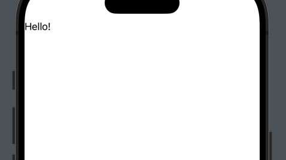

# Geometry Reader and Coordinator + ScrollView

Đầu tiên `GeometryReader` là 1 container, và nó là kiểu `expanding`, có nghĩa là nó sẽ chiếm mọi available space có thể. Đối với các child view bên trong `GeometryReader`, `child views appeared in the top left of the geometry reader.`

```swift
struct TestingGeometryReaderView: View {
    var body: some View {
        GeometryReader { geometry in
            Text("Hello!")
        }
        
    }
}
```

Output:



# I. Global Coordinator + ScrollViewReader

Ta cũng biết rằng mọi screen đều có hệ trục toạ độ `coordinator system` ở phần góc trái màn hình: x = 0, y = 0. Và họ gọi hệ trục toạn độ đó là `global coordinator space`


Để có thể nhìn chính xác hơn, ta sẽ sử dụng nó với `ScrollViewReader` như sau:

```swift
        ScrollView(.vertical, showsIndicators: false) {
            VStack(alignment: .leading, spacing: 16) {
                GeometryReader { gr in
                    RoundedRectangle(cornerRadius: 20)
                        .fill(Color.pink)
                        .overlay(
                            VStack {
                                Text("X: \(Int(gr.frame(in: .global).origin.x))")
                                Text("Y: \(Int(gr.frame(in: .global).origin.y))")
                        })
                }.frame(height: 400)
                
                GeometryReader { gr in
                    RoundedRectangle(cornerRadius: 20)
                        .fill(Color.orange)
                        .overlay(
                            VStack {
                                Text("X: \(Int(gr.frame(in: .global).origin.x))")
                                Text("Y: \(Int(gr.frame(in: .global).origin.y))")
                        })
                }.frame(height: 400)
                
                GeometryReader { gr in
                    RoundedRectangle(cornerRadius: 20)
                        .fill(Color.blue)
                        .overlay(
                            VStack {
                                Text("X: \(Int(gr.frame(in: .global).origin.x))")
                                Text("Y: \(Int(gr.frame(in: .global).origin.y))")
                        })
                }.frame(height: 400)
            }
        } 
```

Output:


Ta thấy rằng từ `(Int(gr.frame(in: .global).origin.x)` ta đã lấy được toạ độ của `GeometryReader`. Tuy nhiên ta vẫn còn 2 loại `coordinator` nữa đó là `local` và `custom`:
- `Global`: Frame relative to the whole screen/superview ie. the whole content view
- `Local`: Frame relative to the immediate parent view
- `Custom`: The custom coordinate space (identifying a view by adding .coordinateSpace(name: "<name goes here>"))


# II. SwiftUI GeometryReader: Stickey Header - Part 4

Ta cũng nên biết rằng, mọi View được nhét vào scrollView, thì kiểu gì cũng sẽ scroll được, kiểu nó auto có bounces ý. Dưới đây là output ta mong muốn có


There are a few things here to understand:
- Như đã biết, `GeometryReader` sẽ fill up all avaialbe space. Khi ta muốn layout 2 views, với view đầu tiên có height = 38% screen, thì bắt buộc ta phải sử dụng `GeometryReader` là `rootView`.
- `GeometryReader` sẽ không đưa ra chính xác height của device nếu ta không sử dụng thuộc tính `ignoreSafeArea`. **Be sure to use edgesIgnoringSafeArea modifier to get a more accurate representation of the available space.** Nhớ là phải `GeometryReader().ignoreSaferArea()` chứ klo phải `View` khác như View cha bọc quanh nó.... Ta lấy VD để dễ hiểu:


```swift
struct LayingOutUsingPhi: View {
    var body: some View {
        GeometryReader { gr in
            VStack {
                Rectangle()
                    .fill(Color.blue)
                    // Adjust the height to be 38% of the device height
                    .frame(height: gr.size.height * 0.38)
                    .overlay(Text("Height: \(gr.size.height * 0.38)"))
                Rectangle()
                    .fill(Color.purple)
                    .overlay(Text("Height: \(gr.size.height * 0.62)"))
            }
            .edgesIgnoringSafeArea(.vertical)
            .font(.largeTitle)
        }
    }
}
```

Output:


Ở đây ta test với device có height là 896, và hãy nhìn output thi được là 310. Tuy nhiên đây là con số sai, bởi vì 896 * 0.38 = 340. Lý do bởi vì ta đang sử dụng thuộc tính `edgesIgnoringSafeArea` cho `VStack` chứ ko phải cho `GeometryReader`. Vì vậy ta cần sử dụng thuộc tính `edgesIgnoringSafeArea` cho `GeometryReader` sẽ thu được kết quả đúng.

Đoạn này thì vào Project mà đọc =)))


# V. Reference

1. [Getting Started with the SwiftUI GeometryReader - Part 1](https://www.bigmountainstudio.com/community/public/posts/12948-getting-started-with-the-swiftui-geometryreader-part-1)
