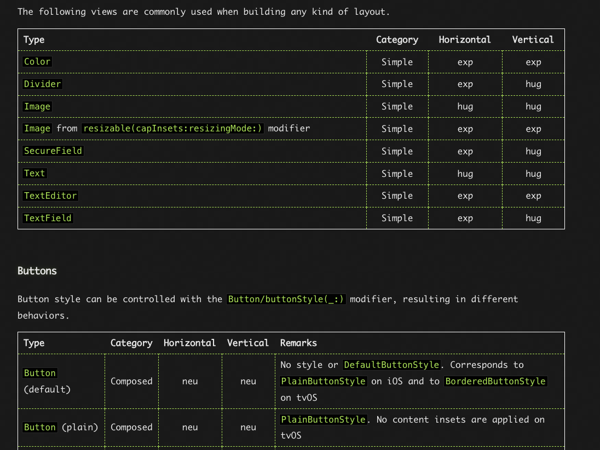
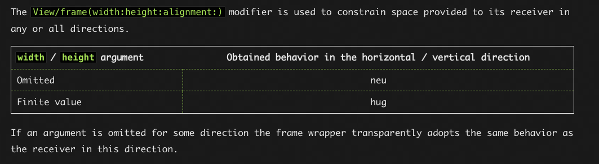
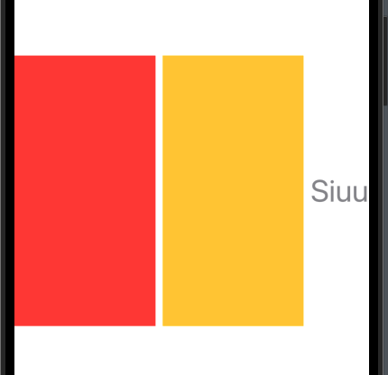
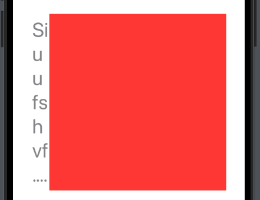
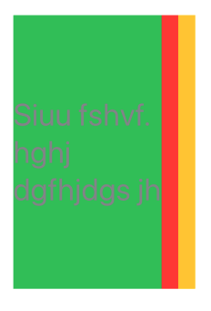
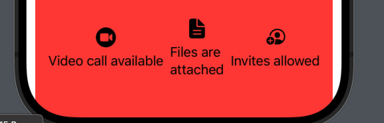
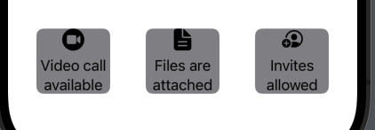
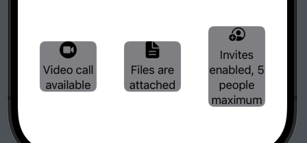

# A guide to the SwiftUI layout system

# I. Sizing Behaviors

- Ta đã biết rằng `children must decide the size`, vì vậy thằng `children` là thằng tự quyết định size của chính nó, thằng cha phải `respect` điều đó, thằng cha không được quyết co hoặc giãn view con bên trong nó. Tuy nhiên sau khi `children lựa chọn xong size củaníó`, thì thằng `parent là thằng quyết định đặt view con đó ở đâu`, thường thông qua thuộc tính `alignment của .frame`.

Hành vi thằng `children` tự chọn size của nó được gọi là `sizing behaviors`. Một view có thể có nhiều `sizing behaviors` theo `horizontal` và `vertical`. Ta có 3 loại `sizing behaviors` lần lượt là:
- `Expanding(exp)`: Ta nhớ lại ở bước 1 `layout process`, thằng cha sẽ propose `frame` cho thằng con, nếu thằng con ở đây mà là kiểu `exp`, thì nó sẽ sử dụng toàn bộ `frame` thằng cha cung cấp.
- `Hugging(hug)`: Với view là `hug`, thì nó sẽ chọn size tốt nhất mà fit với content bên trong nó mà hoàn toàn ko quan tâm tới size mà thằng `parrent offer`.
- `Neutral(neu)`: View sẽ tự điều chỉnh size theo size của thằng con, nó sẽ nhận `hugging behavior` nếu toàn bộ view con của nó là `hugging behavior`, hoặc ko thì nó sẽ là `expanding behavior`.

Dưới đây là một số loại:
- `Expanding`: Color, Divider, Image with resizable, TextEditor, TextFiled(Hor), `Full Shapes`, `frame with .infinity`, `GeometryReader`
- `Hugging`: Image, Text, TextField(ver), `frame with finite value`, `fixedSize`
- `Neutral`: Button, HStack, VStack, ZStack, `View/border(_:width:)`, `View/background(_:alignment:)`, `view/overlay(_:alignment:)`, `View/offset(_:) and View/offset(x:y:)`, `Group`
fixedSize


Khi layout ta hay xét frame cho 1 view, ta có phân loại frame thành 2 loại:

- `Simple Frame`:



Với trường hợp frame được chỉ định cụ thể thì chắc chắn nó là `hug`, còn trong trường hợp ko được chỉ(`omitted`), thì nó sẽ là `neu`, `frame` của nó sẽ phụ thuộc vào `size child` của nó.

- `Advanced Frame`:

Với trường hợp frame được chỉ định cụ thể thì chắc chắn nó là `hug`, còn trong trường hợp ko được chỉ(`omitted`), thì nó sẽ là `neu`, `frame` của nó sẽ phụ thuộc vào `size child` của nó, còn trường hợp `.infinity` thì sẽ lấy tất cả.

## 1.1 Deep Understand

OK giờ ta đã biết view có 3 loại là `exp, hug, neu`. Thực ra thì khi layout, ta thường sử dụng chính là `VSTack, Hstack và ZStack` và 3 loại kể trên đều thuộc loại `neu`, có nghĩa là `contentSize` của nó sẽ phụ thuộc vào `child view` của nó.
- Ở đây ta cũng cần biết rằng, không giống như `UIKit`, `frame` ở đây chỉ là 1 View, và không có constraint gì vào contentView của nó(Trừ thằng `Text` nhé :))). Vì vậy thằng `contentView` hoàn toàn có thể phình to hoặc co lại tuỳ vào `behavio sizing` của nó. Lúc này ta hoàn toàn có thể tách rời 2 thằng `frame` và `contentView`. Thằng `frame` chỉ có 2 tác dụng là xây 1 bản dựng mới, nơi ta có thể apply `background, border, clipShape, overlay` lên, và cuối cùng là xác định vị trí đặt `contentView` đó ở đâu thông qua `alignmanet`.
- Chốt lại là thằng `frame` và `contentSize` ko liên quan đến nhau. Thằng view con tự quyết định size của nó, thằng frame sau đó là thằng quyết định đặt `contentView` đó ở đâu như đặt ở `top, center, bottom, topLeading,...` thông qua `alignment` của `frame`.

OK giờ ta đã hiểu `frame` và `contentView` của 1 view. Ta lại tiếp tục đi vào mấy thằng `stack` đã kể trên. Nhắc lại là mấy thằng `stack` trên đều là `neu`, điều đó có nghĩa là size của `contentView` của nó hoàn toàn phụ thuộc vào các `View Child` bên trong `Stack`. Điều đó cũng có nghĩa mặc dù ta xét `frame` cho các `stack` trên, nó gần như ko tác dụng vào các size của các View con bên trong nó. Ta xét `frame stack là 300x300`, mà size của các `Child View` là `500, 600` thì size của các `childView` đó vẫn ko bị nén lại. Điều đáng nói là khi nào ta đổ background cho `stack` thì backgroun đó mới áp dụng cho `frame 300x300`.

- Giờ ta lấy 1 chút ví dụ:

```swift
struct TestingView: View {
    var body: some View {
        HStack(alignment: .center, spacing: 8) {
            Color.red
            
            Color.yellow
            
            Text("Siuu").layoutPriority(1)
        }
        .frame(height: 300)
        .font(.largeTitle)
        .foregroundColor(.gray)
    }
}|
```



`Giải thích`: Quay lại quá trính `layout system process`, ta sẽ phân tích quá trình cung cấp frame như 1 đoạn thoại như sau:
- SwiftUI hỏi body: Hey tôi có fullscreen cho body, bạn muốn bao nhiêu size.
- Body trả lời: Tôi ko biết, tôi là `neu`, để tôi hỏi thằng con của tôi là `Hstack` nhé,
- Body hỏi `Hstack`, ê `Hstack`, tôi có fullscreen, bạn muốn lấy bao nhiêu.
- `HStack` trả lời: Tôi cũng đ biết, tôi là `neu`, để tôi hỏi thằng con của tôi là `foreground`, `foreground` trả lời tôi cũng là `neu`, để tôi hỏi `font`,
-  `font` sau đó hỏi `frame`, `frame` trả lời: Hollyshit, ở trường hợp này tôi là `hug`, tôi xin `300` height nhé.
- Sau đó thằng cha `HStack` offer cho mấy `View` con bên trong nó: Ê tao có height là 300 này.
- Thằng `Color` trả lời: Ô tôi là `exp`, tôi xin nhận `height là 300 nhé`. Nhưng mà ông ko offer `width`, thế tôi xin hết cho `width` ông được `offer` từ `body` nhé. Thế là trong `content` các Viewctự chia nhau layout với `width` là width được offer cho `HStack` từ `body`.
- Thằng `HStack` là thằng `neu`, và ko được chỉ định `width` rõ ràng nên sẽ nói: ê bọn `content view` bên trong tôi chơi hết chỗ `width` ông cho, nên tôi tự xác định `width` của mình bằng `width` anh cho nhé. 


Từ đây khi xét mức độ ưu tiên ta sẽ có các mức độ ưu tiên sau:
- Mức độ ưu tiên cao nhất: `frame with width and height`: Khi `view child` chỉ định width và height có giá trị xác định như 300 hay 20 thì chắc chắn nó sẽ có width và height xác định như đó bất chấp `view cha có width và height như nào`, hay `priority các view con khác như nào`.
-  Mức độ ưu tiên cao thứ 2: `frame và width của cha`: Khi thằng `parent` chỉ định `width và height` cụ thể, thì có 2 trường hợp xảy ra:
   - `TH1`: Khi có thằng `child view` sử dụng mức độ ưu tiên cao nhất. Thì `width thằng cha sẽ trừ đi widtt thằng có mức đó ưu tiên đó đi`. Nếu vẫn còn thừa thì nó sẽ chia tiếp, nếu ko còn thừa thì những thằng nào ko xét mức độ ưu tiên sẽ ko có frame(dù có xét `layoutPriority` hay không).
   - `TH2:` Khi không có thằng view con nào sử dụng mức độ ưu tiên cao nhất, thì nó sẽ xét tiếp, nếu có thằng con sử dụng `layoutPrority()` thì thằng `view child` đó chắc chắn sẽ được cung cấp nhiều space nhất có thể.

```swift
    HStack(alignment: .center, spacing: 0) {
        Text("Siuu fshvf. hghj dgfhjdgs jh ")
            .layoutPriority(1)
            .frame(width: 30)

        Color.red
            .frame(width: 300)
        
        Color.yellow
            .frame(maxWidth: .infinity)
    //                .frame(width: 90)
            
        
        
            
    }
    .frame(width: 200, height: 300)
    .font(.largeTitle)
    .foregroundColor(.gray)
    .background(.green)
```

Output: 



Bạn thấy không, thằng `yellow` ko xét frame thì nó sẽ ko xuất hiện bởi vì `width` thằng cha có 200, mà mấy thằng khác là 30 và 300 chiếm hết rồi.

```swift
    HStack(alignment: .center, spacing: 0) {
        Text("Siuu fshvf. hghj dgfhjdgs jh ")
            .layoutPriority(1)
    
        Color.red
        
        Color.yellow
            .frame(maxWidth: .infinity)

    }
    .frame(width: 200, height: 300)
    .font(.largeTitle)
    .foregroundColor(.gray)
    .background(.green)

```

output:



Lúc này thằng có `layoutPriority` cao nhất sẽ chiếm nhiều nhất của view cha.

# II. Deep Layout SwiftUI

## 2.1 Resolve problem 1 with .frame(maxWidth: .infinity)

Bắt đầu với `problem`:

```swift
struct EventInfoBadge: View {
    var iconName: String
    var text: String

    var body: some View {
        VStack {
            Image(systemName: iconName)
                .resizable()
                .aspectRatio(contentMode: .fit)
                .frame(width: 25, height: 25)
            Text(text)
        }
    }
}

struct Part2View: View {
    var body: some View {
        VStack {
            
            Spacer()
            HStack {
                EventInfoBadge(
                    iconName: "video.circle.fill",
                    text: "Video call available"
                )
                EventInfoBadge(
                    iconName: "doc.text.fill",
                    text: "Files are attached"
                )
                EventInfoBadge(
                    iconName: "person.crop.circle.badge.plus",
                    text: "Invites allowed"
                )
            }
        }
        .padding()
        .background(.red)
    }
}
```

Output:



Ta thấy rằng các view con của nó ko có cùng width, để chia cùng with với nhau ta phải xét `.frame(maxWidth: .infinity)` cho `Text` hoặc `VStack` như sau:

```swift
struct EventInfoBadge: View {
    var iconName: String
    var text: String

    var body: some View {
        VStack {
            Image(systemName: iconName)
                .resizable()
                .aspectRatio(contentMode: .fit)
                .frame(width: 25, height: 25)
            Text(text)
                .frame(maxWidth: .infinity)
        }
    }
}
```

OK giờ ta sẽ thay đổi chút modifer của `EventInfoBadge` như sau:

```swift
struct EventInfoBadge: View {
    var iconName: String
    var text: String

    var body: some View {
        VStack {
            Image(systemName: iconName)
                .resizable()
                .aspectRatio(contentMode: .fit)
                .frame(width: 25, height: 25)
            Text(text)
                .frame(maxWidth: .infinity)
                .multilineTextAlignment(.center)
        }
        .background(.secondary)
        .cornerRadius(8)
        .padding()
    }
}
```

Output:



OK giờ nhìn nó giờ khá clean.

## 2.2 Resolve Problem 2 with Geometry, preferences, and layout dependencies

```swift
struct EventInfoList: View {
    var body: some View {
        HStack {
            EventInfoBadge(
                iconName: "video.circle.fill",
                text: "Video call available"
            )
            EventInfoBadge(
                iconName: "doc.text.fill",
                text: "Files are attached"
            )
            EventInfoBadge(
                iconName: "person.crop.circle.badge.plus",
                text: "Invites enabled, 5 people maximum"
            )
        }
    }
}
```

Output:




Nhìn nó cũng tạm ổn, nhưng ta mong muốn phần `height` sẽ cao bằng nhau ở background. Để làm được điều đó, ta phải thông báo tới `EventInfoList` rằng `maximumHeight` có thể có là bao nhiêu. 

```swift
struct HeightSyncedRow<Content: View>: View {
    private let content: Content
    @State private var childHeight: CGFloat?

    init(@ViewBuilder content: () -> Content) {
        self.content = content()
    }

    var body: some View {
        HStack {
            content.frame(height: childHeight)
        }
    }
}

struct EventInfoList: View {
    var body: some View {
        HeightSyncedRow {
            EventInfoBadge(
                iconName: "video.circle.fill",
                text: "Video call available"
            )
            EventInfoBadge(
                iconName: "doc.text.fill",
                text: "Files are attached"
            )
            EventInfoBadge(
                iconName: "person.crop.circle.badge.plus",
                text: "Invites enabled, 5 people maximum"
            )
        }
    }
}
```

Bây giờ nhiệm vụ của ta là tính giá trị `childHeight` của `HeightSyncedRow`. Để làm được điều đó đó, ta phải làm mỗi `child views` thông báo height của nó thông qua `view hierachy` để làm được `height` cao nhất, vì vậy ta sẽ sử `SwiftUI’s Preferences system`. `SwiftUI’s Preferences system ` cho phép chúng ta đính kèm `1 value` với `1 preference key` với 1 `child view`, `value` đó sau đó có thể được đọc bởi `parents của chúng nó`.

- Đầu tiên ta cần implement 1 struct comform với `PreferenceKey`, sau đó ta cần triển khai `defaultValue` và một method cho việc `eeducing two values (the previous and next) into one — like this`.

```swift
private struct HeightPreferenceKey: PreferenceKey {
    static let defaultValue: CGFloat = 0

    static func reduce(value: inout CGFloat,
                       nextValue: () -> CGFloat) {
        value = nextValue()
    }
}
```

Sau đó ta cần sử dụng `GeometryReader` cho phép chúng ta đọc size của `current view's container`. Bằng cách embedding 1 `GeometryReader` vào `background`, ta có thể thực hiện các hành động đọc mà ko ânhr hưởng tới `layout của view`. Bởi vì `background view` luôn luôn chiếm toàn bộ avalable space của 1 frame nên thằng `GeometryReader` sẽ ko thể lấy được gì cả.

```swift
extension View {
    func syncingHeightIfLarger(than height: Binding<CGFloat?>) -> some View {
        background(GeometryReader { proxy in
            Color.clear.preference(
                key: HeightPreferenceKey.self,
                value: proxy.size.height
            )
        })
        .onPreferenceChange(HeightPreferenceKey.self) {
            height.wrappedValue = max(height.wrappedValue ?? 0, $0)
        }
    }
}
```

With the above in place, we can now go back to our HeightSyncedRow and simply make it apply our new syncingHeightIfLarger modifier to its content view — which in turn will make each of its children adopt the exact same height:

```swift
struct HeightSyncedRow<Content: View>: View {
    private let content: Content
    @State private var childHeight: CGFloat?

    init(@ViewBuilder content: () -> Content) {
        self.content = content()
    }

    var body: some View {
        HStack {
            content.syncingHeightIfLarger(than: $childHeight)
                   .frame(height: childHeight)
                   .background(Color.red)
        }
    }
}
```


# V. Reference
1. [Understanding SwiftUI Layout Behaviors](https://defagos.github.io/understanding_swiftui_layout_behaviors/?fbclid=IwAR1X3vDcR4Qr3FCdNZXLIzc0_KJRyD-Di7LpVk8VP5S0p-At6iE-1I_yu-I)
2. [A guide to the SwiftUI layout system](https://www.swiftbysundell.com/articles/swiftui-layout-system-guide-part-2/)
3. [How an Hstack Lays out Its Children](https://www.objc.io/blog/2020/11/10/hstacks-child-ordering/)