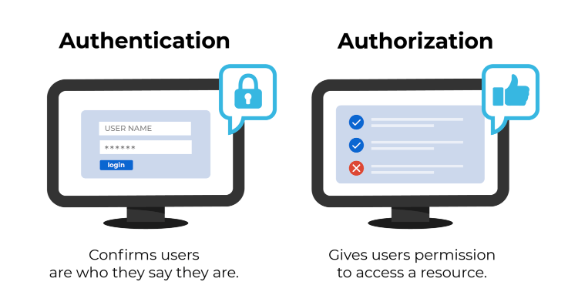
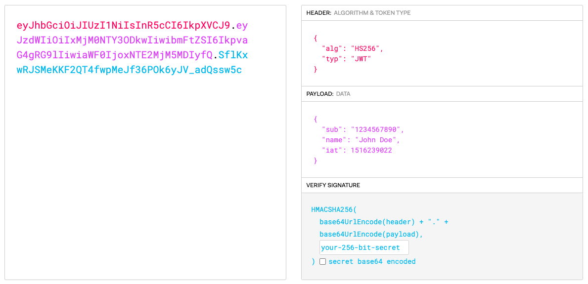
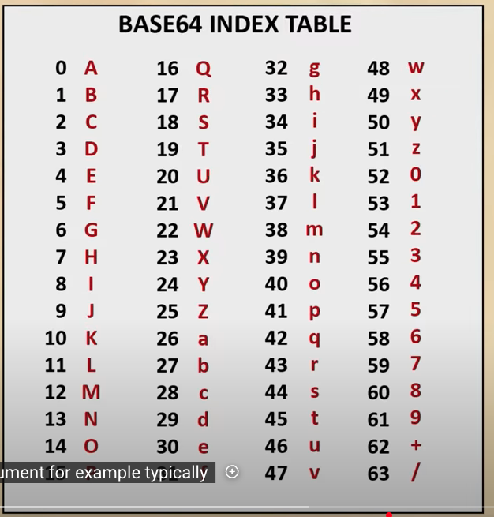
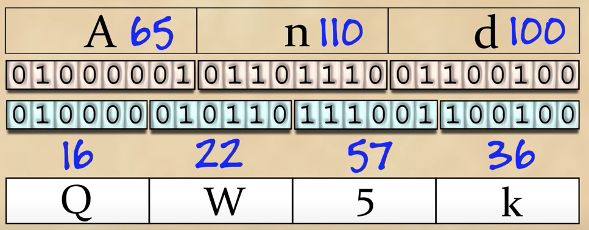

# Internet


# I. Authentication and Authorization

Cơ bản thì `Authenication` sẽ xác thực rằng `user` là ai. Còn `Authorization` sẽ cho người dùng quyền để truy cập đến một tài nguyên nào đó.

1. What Is Authentication?

`Authenticaiton` là một hành động để xác định rằng `user` có phải chính người họ tuyên bố họ là hay không. Đây là bước đầu tiên của mọi quá trình bảo mật. Complete an authentication process with:

- `Passwords`: `Usernames` và `passwords` là các yếu tố xác định người dùng nhất. Nếu người dùng nhập dữ liệu chính xác, hệ thống sẽ coi danh tính là hợp lệ và cấp quyền truy cập.
- `One-time pins`: Grant access for only one session or transaction.
- ....

2. What Is Authorization?

`Authorization` trong hệ thống bảo mật là quá trình cho phép người dùng quyền để `truy cập vào một tài nguyên hoặc function`.  Ví dụ: Ta cho phép một ai đó quyền để download 1 file nào đó từ server(Ở đây là ta cho phép 1 ai đó truy cập vào 1 tài nguyên file và cho phép download). Trong môi trường an toàn(In secure environments), `authorization` luôn luôn phải tuân theo `authenticaiton`. `User` đầu tiên phải chứng mình đinh danh của mình trước khi hệ thống cho phép họ truy cập vào tài nguyên được yêu cầu.




# II. JWT

`JWT` viết tắt của `Json Web Token`, nó được sử dụng cho các `websites và apps` để xác minh người dùng đang là ai một cách an toàn. Một cấu trúc `JWT` gồm 3 phần: `header, payload, signature`. Mỗi một thành phần được ngăn cách nhau bởi dấu chấm `(.)`




- `Header` gồm 2 phần: Phần 1 là kiểu của token đó, và 99% giá trị của nó là `JWT`. Phần 2 là thuật toán được sử dụng ở phần 3.

```php
{
  "alg": "HS256",       //Thuật toán mã hoá ở phần signature
  "typ": "JWT"
}
```

Sau đó chuỗi Json này sẽ được `Bae64Url encoded` để tạo thành phần đầu tiên của `JWT`

- `Payload` gồm các cặp key value gồm `claims(user attributes)`(được liệt kê ở [here](https://www.iana.org/assignments/jwt/jwt.xhtml)) và ` additional data like issuer, expiration time, and audience.`

```php
{
  "sub": "1234567890",
  "name": "John Doe",
  "admin": true
}
```

Sau đó chuỗi Json này sẽ được `Bae64Url encoded` để tạo thành phần phần thứ 2 của `JWT`

- `Signature`: Để tạo nên `signature` ta cần encoded `header, payload và một secret key` và sử dụng thuật toán mã hoá ở phần header. Ví dụ ở phần header ta sử dụng thuật toán mã hoá `HS256 - HMAC SHA256`, thì phần `signature` sẽ được tạo theo cách sau đây:

```php
HMACSHA256(
  base64UrlEncode(header) + "." +
  base64UrlEncode(payload),
  secret)
```


## 2.1 How do JSON Web Tokens work?

Trong quá trình `Authentication`, người dùng đăng nhập thành công, một `Json Web Token` sẽ được trả về cho người dùng. `JWT` này có phần payload được sử dụng để xác đinh user, xác đinh quyền, thời hạn của token,... Bất kì khi này người dùng muốn truy cập vào một tài nguyên protected, `user agent - cái này ta sẽ tìm hiểu sau` sẽ gửi cùng một mà `JWT` đi cùng thường trong phần header như sau:

```php
Authorization: <token>
```

Khi ta gửi mã `JWT` thông qua HTTP header, ta trành không nên gửi nó quá nặng. Một vài server ko chập nhận size lớn hơp 8Kb trong phần header.

## 2.2 Vậy tại sao thằng JWT lại bảo mật và tại sao ta nên dùng nó.

Giả sử ta có phần header và payload như này:

```php
{
  "alg": "HS256",       //Thuật toán mã hoá ở phần signature
  "typ": "JWT"
}

{
  "sub": "1234567890",
  "name": "John Doe",
  "exp": 12345855555
}
```

Giả sử có thằng hacker nào trôm được token của ta, thì nó cũng chỉ sử dụng được vài tiếng, bởi vì có `exp` là thời gian hết hạn tọken. OK giờ sẽ có câu chuyện là bằng cách nào đó nó thay đổi được phần `exp` sang 10 năm nữa và thêm quyền `admin: true` để thằng hacker đó có quyền truy cập cao hơn thì sao? Câu trả lời là điều này chắc chắn sẽ ko thành công. Bởi vì ta hãy nhần phần `signature`, nó được mã hoá bởi 3 thành phần là `header, payload và secret key`. Phần `secretkey` sẽ được giữ bởi server nên hacker sẽ ko biết, thứ 2 là khi thay đổi phần body thì chắc chắn phần signature sẽ bị thay đổi. Dẫn đến server nhận được `JWT` sẽ decoded ra và check sẽ thấy được.


- Vậy tại sao ta nên dùng nó mà ko dùng `session`:

Bởi vì nó bảo mật và thứ 2 là nó sẽ hữu dụng trong các trường hợp này hơn là sử dụng `session`. Đầu tiên là với thằng `session`, sau khi user authenticaiton, `server` sẽ giữ thông tin `sessionID` của user và send back thông tin đó cho user, để truy cập các tài nguyên thì user cần gửi `sessionID` này đi cùng(nghe khá giống `JWT` đúng ko ?). Tuy nhiên điểm khác biệt là với `JWT` là `stateless`, nghĩa là server sẽ ko giữ bất kì thông tin nào về phía `client`, mà nó sẽ xác định thông tin qua `JWT`. Nghĩa là nhờ phần `payload` của `JWT`, `server` sẽ biết được client là ai như thông qua `name, admin,...`.  Vậy thì cái naỳ có gì đặc biệt ? Câu trả lời là có nếu 1 hệ thống đặt 2 server chứa 2 cơ sở dữ liệu ở vị trí khác nhau. Như `server 1` chứa thông tin về `tên, tuổi, bài post của user`, còn `server thứ 2 sẽ chứa họ hàng, điểm số,..`. Khi user log in vào server 1 để truy cập, nếu sử dụng `sessionID` thì thông tin `sessionID` đó chỉ đang được lưu ở `server 1`, và người dùng sẽ phải tiếp tục login hay qua 1 bước nào đó nếu muốn truy cập vào `server 2`. Điều này hoàn toàn đơn giản khi sử dụng `jwt`, bởi vì server ko lưu giữ thông tin gì cả mà nó được xác định hoàn toàn qua payload.


# III. Base64 Encoding

Ta biết rằng có hệ 2 là `0, 1`, hệ 10 là từ `0 đến 9`, và hệ 16 là `0 đến 9 và A,B,C,D,E,F`, vậy hệ 64 cũng thế, nó gồm các chữ cái viết thường, các chữ cái viết hoa và gồm các số từ `0 đến 9 và thêm dấu + và \`.



Ta lấy ví dụ:




Giải thích:

- Ta có chứ `And`, tương ứng với giá trị `64`, `110`, `100` trong hệ cơ số 10. Ta convert nó sang hệ nhị phân và được value bên dưới. Sau đó ta tách thành các phần `6 bits`, bởi vì `6 bit sẽ có tổng là 64 = 2^5 + ... + 2^0`. Sau đó từ đó đối chiều về bảng base64 ở bên trên. Kết quả là từ `And` sau qua `base64` sẽ được `QW5k`


# X. Reference

1. [ JSON Web Token (JWT)](https://datatracker.ietf.org/doc/html/rfc7519)
2. [JSON Web Token Structure](https://auth0.com/docs/secure/tokens/json-web-tokens/json-web-token-structure)
3. [Auth: 03 - JWT là gì và những điều cần biết 🎉](https://www.youtube.com/watch?v=o4NSbpJ4VdE)
4. [Debugger JWT](https://jwt.io/)
5. [JSON Web Token (JWT) Assignment](https://www.iana.org/assignments/jwt/jwt.xhtml)
