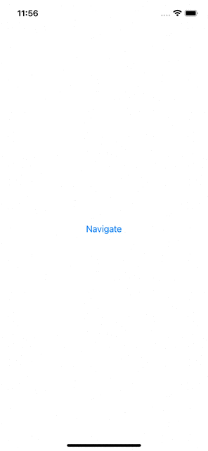
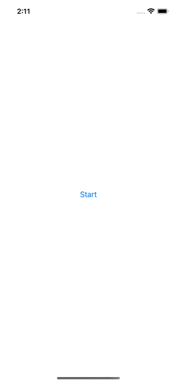

# Navigation Stack and Navigation Link

# I. NavigationLink

Về cơ bản đây là 2 cách dùng đơn giản nhất giữa `NavigationLink` và `NavigationStack`:

```swift
NavigationStack {
    NavigationLink("Navigate", value: "AppCircle")
        .navigationDestination(for: String.self) { value in
            Text("Second screen")
            Text("Value is \(value)")
    }
}
```

Output:




Và 

```swift
NavigationStack {
    NavigationLink {
        Text("Siuuu")
    } label: {
        Text("Siuuuu screen")
    }
}
```

# II. Pop To Root

`NavigationStack` có 1 phương thức init chấp nhận tham số là một `array of navigation paths`. Ta có thể coi `Paths` như là một `data source representing all views in a navigation stack.`:
- To pop a view, you remove that path from the array.
- To pop to the root view, you remove everything out of that array.

```swift

struct LearnAnimationStack: View {
    @State private var path: [Int] = []
    
    var body: some View {
        
        NavigationStack(path: $path) {
            Button("Start") {
                path.append(1)

            }
            .navigationDestination(for: Int.self) { int in
                DetailView(path: $path, count: int)
            }
        }
    }
}

struct DetailView: View {

    @Binding var path: [Int]
    let count: Int
    
    var body: some View {
        VStack(alignment: .leading, spacing: 8) {
            Button("Go deeper \(count)") {
                path.append(count + 1)
            }
            .navigationBarTitle(count.description)
            .toolbar {
                ToolbarItem(placement: .bottomBar) {
                    Button("Pop to Root") {
                        path = []

                    }
                }
            }
            
            Button("Go back ") {
                path.remove(at: count - 1)
            }
            
        }

    }
}
```

Output:




# III. Reference

1. [How to Pop to the Root view in SwiftUI](https://sarunw.com/posts/how-to-pop-to-root-view-in-swiftui/?fbclid=IwAR0kJf86XoYteFXX-P8VOU0K81FGvfx8Bai39nNeKRHzFY2CFHkmVevlK3o)